# Iris_dataset
## It contains four features sepal length, sepal width, petal length and petal width also contains label to tell the type of the flower where types of the flower are : setosa, versicolor and virginica.

## Histogram:
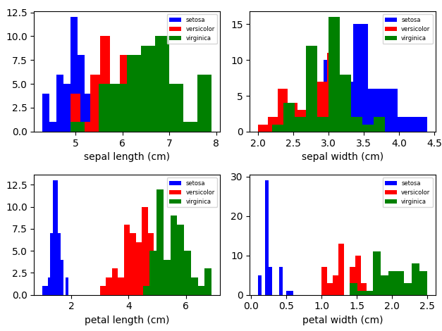

## 2D-Scatters:
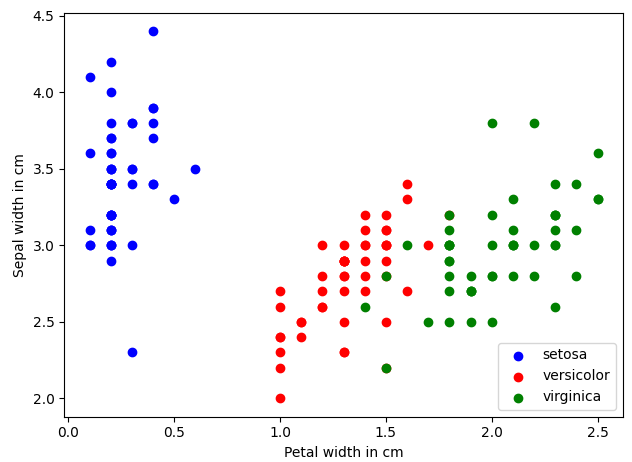
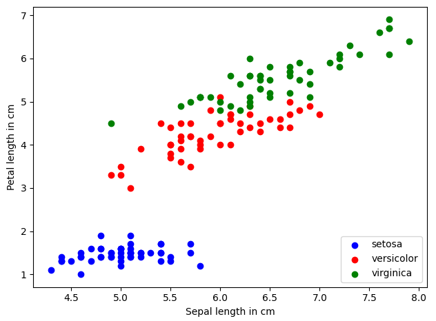
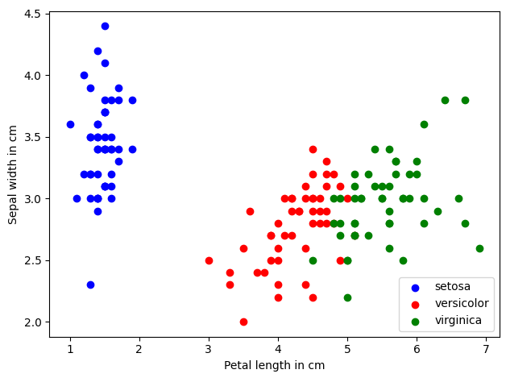
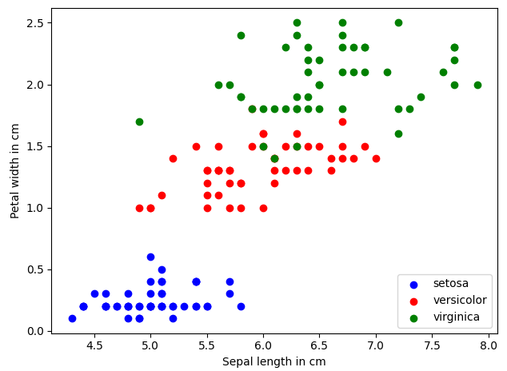
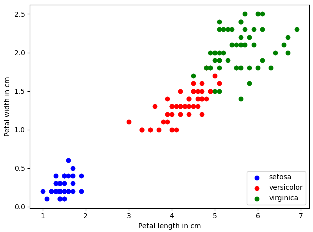
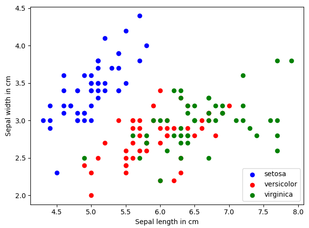

## 3D-Scatters:
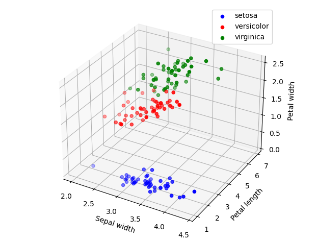
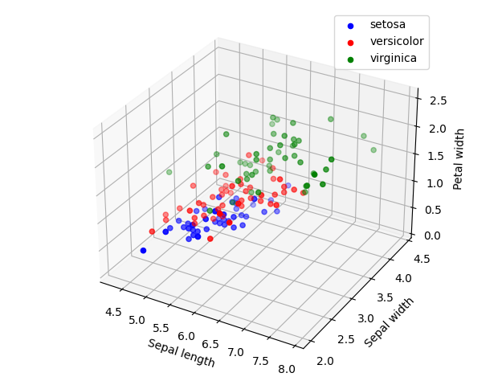
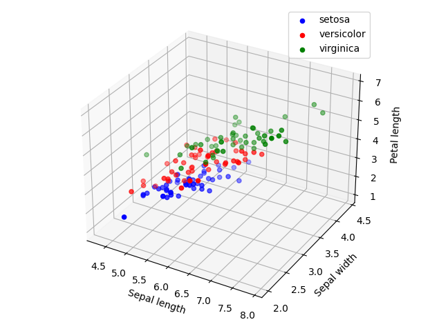
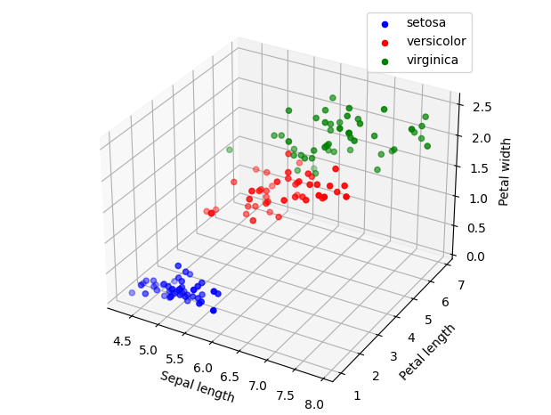

## Box plots:
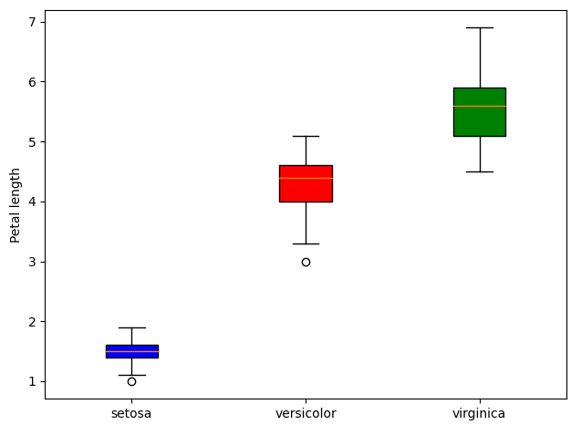
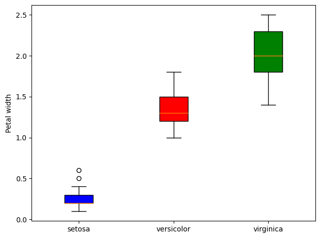
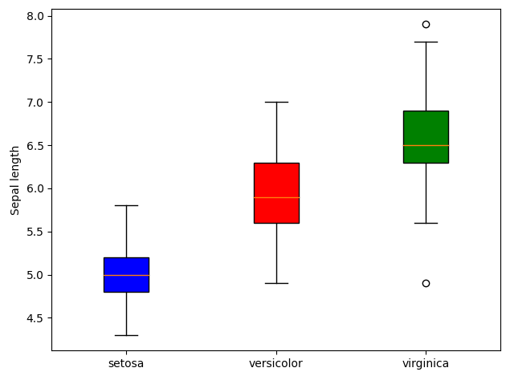
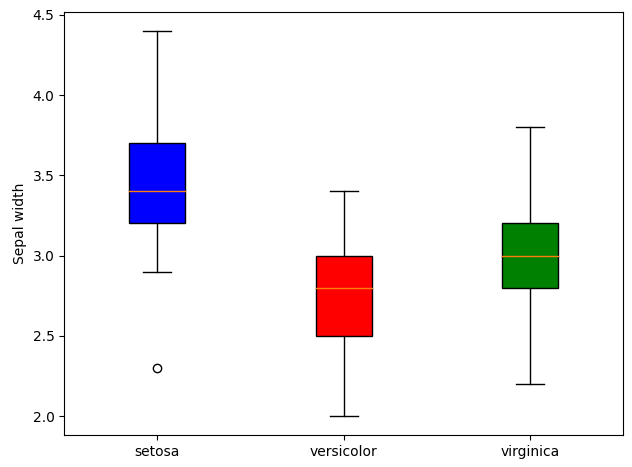

## Correlation matrix:
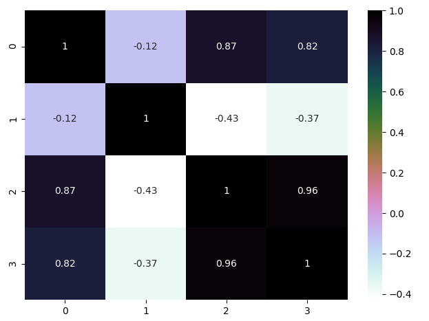

### Observation:
The Sepal Width and Length are not correlated The Petal Width and Length are highly correlated.

